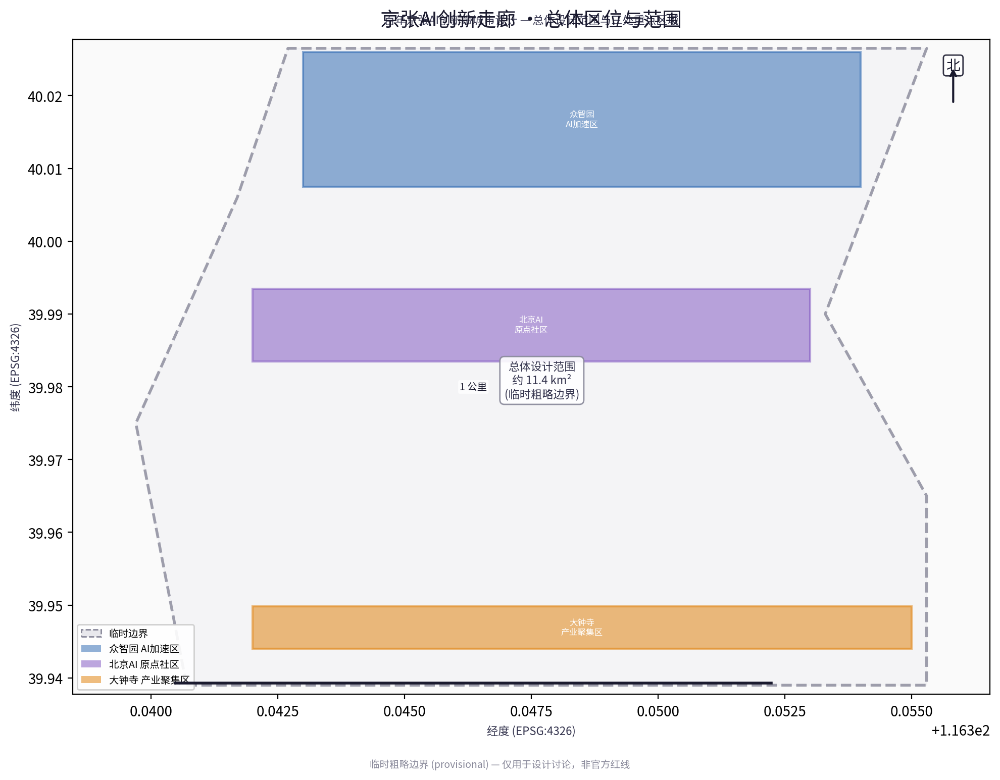
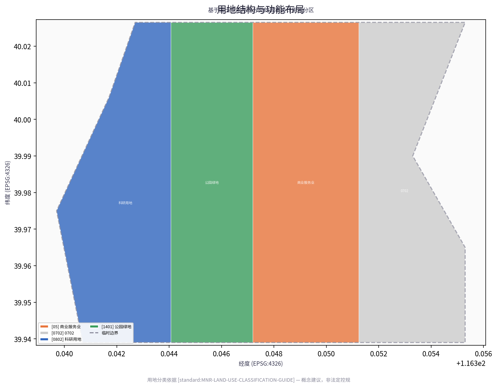
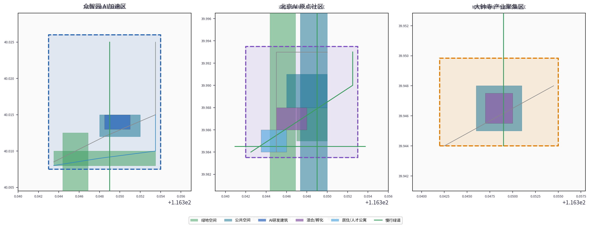
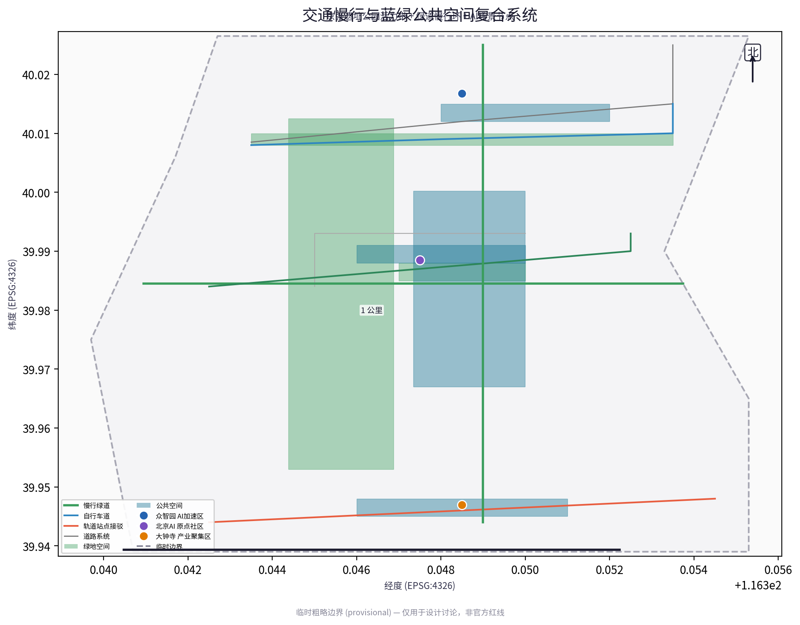
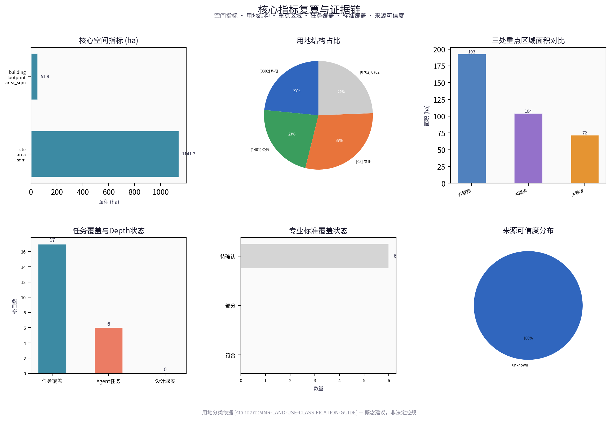

# Jingzhang AI Innovation Corridor: Smart Urban Regeneration of a Century-Old Railway Heritage Site

## Design Basis and Data Inventory

This formal scheme takes as its primary basis the "Prequalification Announcement for the International Call for Urban Design Proposals for the Century-Old Jingzhang AI Innovation Belt" issued by the Haidian Branch of the Beijing Municipal Commission of Planning and Natural Resources, and uses as machine-readable evidence the provisional coarse boundaries, key areas, enumerations, metrics, and source lists registered by maintainers in `brief/site-package/`. Before generating the scheme, the AI agent must read `design_brief.json`, `allowed_design_space.json`, `sources.json`, `enums/`, `ranges/`, `schemas/`, `data/source_registry.json`, and `data/processed/agent_fact_pack.md`, and use `project_scope_summary.csv`, `agent_task_requirements.csv`, `source_use_matrix.csv`, and `missing_data_checklist.csv` to establish inventories of tasks, scope, data usage, and gaps. All design judgments must be decomposed into traceable sources, recalculable metrics, verifiable layers, and manually reviewable assumptions. The announcement requires the scheme to reach the urban design depth of regulatory detailed planning and the urban design depth of a comprehensive planning implementation scheme; therefore, narrative text cannot substitute for GeoJSON, metric tables, A3 booklets, A0 boards, and HTML electronic presentation deliverables.

The scheme is not a standalone vision document but is organized from the announcement, the agent-oriented taskbook, and site data; this section places only the most critical evidence beside each judgment [source:OFFICIAL-ANNOUNCEMENT] [source:AGENT-TASKBOOK] [depth:existing_conditions_diagnosis]. Complete source and standard coverage are stored in `sources.json`, `standard_matrix.json`, and `design_depth_matrix.json` respectively, and machine indices are not repeated in the body text.

The usage boundaries of the data registry are as follows [source:SOURCE-REGISTRY]:

- data/source_registry.json registers the usage boundaries of public, rights-cleared, and provisional data.
- Current registry summary: 7 formal-available items, 1 background item, 1 provisional-only item.
- The agent must not elevate background_only or provisional_only data to official boundary, statutory regulatory planning, formal scoring evidence, or government implementation commitments.

`data/processed/agent_fact_pack.md` is the reading-navigation layer for this scheme, not a new authoritative source [source:PROCESSED-FACT-PACK]. It helps the agent organize the three-level scope, the three key areas, the announcement tasks, agent.1–agent.6, data availability, and missing-data items into a readable scheme; factual judgments must still return to the registered source materials [source:OFFICIAL-ANNOUNCEMENT] [source:AGENT-TASKBOOK], and the complete source relationships are preserved in `sources.json`.

When the official `SITE_BOUNDARY` or the three `KEY_AREA` polygons are not yet available, this scaffold uses `brief/site-package/geometry/provisional_boundaries.geojson` to generate a provisional formal package. The `geometry/site_boundary.geojson` and `geometry/key_areas.geojson` in the submission package must both be annotated as `provisional_constraint`, `official_boundary=false`; they may be used only for scheme generation, self-checks, visualization, and design discussion, and must not serve as official redlines, approval evidence, precise area evidence, or statutory control conclusions. This organizer-side data gap does not, by itself, block content scoring; once official polygons are replaced, site boundary, key areas, land use, roads, green space, public space, buildings, phasing, and metrics must all be recalculated.

The scorability status produced by this scaffold run is: **provisional boundaries, with accuracy caveats retained pending recalculation upon release of official data; content scoring is not blocked**. Accordingly, the spatial structure, scenarios, projects, and metrics in the body text are written to the principle of "discussable, reviewable, and recalculable upon replacement of official boundaries"; when official boundary and key-area polygons are updated, the agent must rerun the scaffold, self-checks, and drawing/HTML generation, and must not merely swap individual files.

Boundary interpretation can be traced back to the overall scope layer and area recalculation [data:geometry/site_boundary.geojson#SITE-001] [metric:site_area_sqm]. The three key areas are checked against independent layers and count metrics [data:geometry/key_areas.geojson#PROV-KEY-001] [metric:key_area_count]. This means readers can move from the body text into the evidence, but need not first parse a string of machine codes.

## Three-Level Scope Working Framework

The scheme organizes its work across the three levels defined by the announcement: the coordinative research scope addresses the AI industry ecosystem, strategic positioning, innovation chains, and future urban form across 43.6 square kilometers; the overall design scope addresses the 11.4-square-kilometer urban area and industrial districts within 1–2 kilometers around the Jingzhang Relics Park (京张遗址公园), requiring an overall urban renewal framework, industrial spatial layout, transport and municipal support, and urban character controls; the key-area scope addresses the three detailed-design areas totaling 368.4 hectares, requiring clear functional programs, building scales, retain-renovate-demolish classifications, public-space connectivity, and traffic organization. The three levels are mapped item by item in `compliance_matrix.json`, ensuring that the mandatory tasks of announcement sections 1.3, 1.4, 1.5, and agent.1–agent.6 each have chapters, layers, metrics, drawings, and HTML evidence.

The depth items of the three-level working framework are governed by [depth:three_level_scope_framework] and [depth:overall_spatial_structure]; spatial evidence is anchored to [data:geometry/site_boundary.geojson#SITE-001] and [data:geometry/key_areas.geojson#PROV-KEY-001]; task evidence is anchored to [standard:PROJECT-OFFICIAL-ANNOUNCEMENT]; and the scope index is navigated via the three-level scope table in `project_scope_summary.csv` within [source:PROCESSED-FACT-PACK].

The three levels of work are not isolated sets of drawings. Coordinative research determines industry-chain and urban-form judgments; overall design translates those judgments into renewal projects, spatial structure, and facility capacity; and key-area detailed design validates the implementability of specific plots, buildings, transport, public space, and AI application scenarios. When generating the scheme, the agent must first lock the official or provisional boundaries and constraints adopted for the current submission, then generate land use, buildings, roads, green space, public space, phasing, and AI service nodes, and finally recalculate metrics from those layers and explain in the body text which conclusions remain constrained by provisional boundaries. No area, proportion, scale, or project count that cannot be recalculated from structured data may be written as a formal conclusion.

The overall concept proposed by this scheme is the "Jingzhang Smart-Vein Symbiosis Belt": taking the Jingzhang Relics Park as the historical and public-space spine, the three key areas — Zhongzhiyuan (众智园), Beijing AI Origin Community (北京AI原点社区), and Dazhongsi (大钟寺) — as innovation anchors, and universities, enterprises, communities, and rail stations as the everyday network, forming a spatial organization of "one belt, three cores, multiple-point scenarios, and a blue-green slow-mobility composite ring." Here, "one belt" is not a newly drawn redline but a translation of the announcement's three-level scope into a working method; "three cores" correspond to the three key areas; "multiple-point scenarios" correspond to operable nodes for AI plus public services, industry services, and urban life; and the "composite ring" corresponds to the linkage of slow mobility, green space, public space, and activity routes.

| Level | Design question | Scheme response | Data anchor |
| --- | --- | --- | --- |
| Coordinative research scope | How to organize the AI industry ecosystem and future urban form | Establish an innovation chain of "university origination — open-source collaboration — enterprise translation — public experience — international communication" | compliance_matrix.json, standard_matrix.json |
| Overall design scope | How industrial space, urban renewal, transport/municipal works, and character are mapped | Expressed jointly through land-use, building, road, green-space, public-space, and phasing layers | [data:geometry/land_use.geojson#LU-001], [data:geometry/roads.geojson#ROAD-001] |
| Key-area scope | How the three districts reach detailed-design depth | Each proposes positioning, spatial actions, AI scenarios, and implementation dependencies | [data:geometry/key_areas.geojson#PROV-KEY-001], [data:geometry/key_areas.geojson#PROV-KEY-002], [data:geometry/key_areas.geojson#PROV-KEY-003] |

## Coordinative Research Scope: Industry and Future-City Research

The core task of the coordinative research scope is to build a world-class AI innovation ecosystem. The scheme should survey Haidian's universities and research institutes, leading enterprises, computing-power/algorithm/data elements, incubation platforms, listed companies, unicorns, and technology-service resources, and propose a spatial coordination framework for the AI innovation chain, industry chain, talent chain, and urban service chain. Naming and logo design should serve the overall recognizability of the "Century-Old Jingzhang Cultural Belt, Urban AI Life Experience Belt, and AI Convergence Innovation Belt," and must not remain at the level of slogans; they should explain the links to the industrial ecosystem, public space, and cultural resources. The agent-oriented taskbook also requires responses to the "five major functions" and the "three districts and two wings" coordination, forming a naming system, visual identity, overall spatial-structure diagram, scenario openings, and operating mechanisms that can be further developed; this section must use [source:AGENT-TASKBOOK] and [standard:PROJECT-AGENT-OPEN-CALL-TASKBOOK] to mark that these requirements originate from the agent open-call task, not from statutory planning controls.

Coordinative research does not introduce pseudo-precise redlines; through the urban-character, public-space, and building-layout coordination required by [standard:MOHURD-URBAN-DESIGN-MEASURES], it connects back to [data:geometry/land_use.geojson#LU-001], [data:geometry/public_space.geojson#PUBLIC-001], and [depth:overall_spatial_structure], demonstrating that industrial strategy must ultimately land in a visible, reviewable spatial structure.

Future-city form research should answer how artificial intelligence transforms work, life, social interaction, learning, transport, and public services. The scheme should translate AI transport systems, continuous green space, innovation-service facilities, and an internationalized live-work atmosphere into locatable functional zones, nodes, corridors, and scenarios, rather than vaguely describing technology visions. The agent should write industrial-strategy metrics, the AI innovation index, talent density, spatial-supply typologies, and AI+ vertical-application focus areas into the metric system, and indicate which are official, which are design suggestions, and which still await formal-data calibration. Where global AI innovation events, developer communities, open scenarios, or pilgrimage routes are proposed, they should be written as "concept suggestions / reference schemes / for further study by professional teams," and must not be written as already-confirmed government events or implementation arrangements.

## Overall Design Scope: Urban Renewal and Regulatory-Planning-Depth Urban Design

The overall design scope requires reaching the urban design depth of regulatory detailed planning. The scheme must propose an overall spatial structure for urban renewal, identification of inefficient space, a renewal project list, implementation policy recommendations, industrial function proportions, spatial organization models, total building scale, and a comprehensive carrying-capacity assessment. `geometry/land_use.geojson` should fully cover the design boundary with no overlaps; `geometry/buildings.geojson` should express renewal or retained building footprints; `geometry/roads.geojson` should express micro-circulation, slow mobility, and rail-station intermodal connections; and `metrics.json` should recalculate core areas, proportions, and layer counts.

This section decomposes regulatory-depth content into reviewable objects per [standard:MOHURD-CONTROL-DETAILED-PLANNING]: [data:geometry/land_use.geojson#LU-001] expresses land-use structure, [data:geometry/buildings.geojson#BLDG-001] expresses building footprints, [data:geometry/roads.geojson#ROAD-001] expresses traffic organization, [metric:building_footprint_area_sqm] is used to verify building footprint area, and [depth:land_use_layout] and [depth:development_intensity_controls] constrain deliverable depth.

Overall design must also support transport, rail, municipal, and supporting facilities. The scheme should propose spatial layouts and implementation pathways for rail-station integration, road micro-circulation, non-motor-vehicle parking, parking supply, innovation service platforms, talent living services, new infrastructure, distributed energy, and edge-side computing power. For content involving building heights, development intensity, road redlines, setbacks, and facility standards, where official control conditions are not yet available, it should be written as "pending confirmation of formal regulatory planning conditions," and must not present agent-inferred values as approved metrics.

## Key-Area Detailed Design

Key-area detailed design is mandatory. The Zhongzhiyuan AI Acceleration Area (众智园AI自主创新加速区) should propose detailed schemes around the national AI platform, full-stack self-innovation, standards development, safety governance, industry exhibition, external transport, Qinghe (清河) culture, a low-carbon green innovation-interaction environment, and green-space AI scenarios. The Beijing AI Origin Community should propose detailed schemes around near-campus innovation, achievement incubation and translation, talent special zones, open-source systems, branded events, building retain-renovate-demolish, achievement exhibition and release, residential and living supporting facilities, campus-park slow-mobility connections, and rail-station integration. The Dazhongsi AI Industry Cluster Area (大钟寺AI产业聚集区) should propose detailed schemes around leading enterprises, agents, intelligent terminals, content consumption, data elements, digital assets, commercial services, composite use of planned green space, Dazhongsi Station (大钟寺站) integration, and four-quadrant pedestrian connectivity at intersections.

The detailed design of the three key areas must reference [data:geometry/key_areas.geojson#PROV-KEY-001], [data:geometry/key_areas.geojson#PROV-KEY-002], and [data:geometry/key_areas.geojson#PROV-KEY-003], and is checked by [depth:three_key_area_detailed_design] for whether it reaches the depth of a comprehensive planning implementation scheme. If only "building a demonstration zone" is described without evidence of functions, buildings, transport, public space, and implementation projects, it should be regarded as incomplete.

The three key areas must appear in `geometry/key_areas.geojson`. If the repository already provides official polygons, they should be used as `official_constraint`; if official polygons are missing, `provisional_constraint` may be used provisionally, but the body text, HTML, sources, assumptions, and self_check must state that it cannot serve as formal scoring or approval evidence. `compliance_matrix.json` should cover announcement sections 1.5.3.1, 1.5.3.2, and 1.5.3.3 respectively. Design expression should include functional programs, building scale, building form, retain-renovate-demolish classification, public-space systems, traffic organization, slow-mobility connectivity, and implementation projects. HTML pages should allow switching between the three key areas, and A3 booklets and A0 boards should include at minimum a key-district master plan, partial detail drawings, and metric notes.

| Key district | Design positioning | Spatial actions | AI industry and operating scenarios | Evidence references |
| --- | --- | --- | --- | --- |
| Zhongzhiyuan AI Acceleration Area | Garden-type full-stack self-innovation district | Strengthen the Qinghe frontage, industry exhibition, low-carbon innovation interaction, and external transport organization; use green space to host open testing and standards-governance display | Self-developed model testing, standards-development workshops, safety-governance display, low-carbon computing-power experience | [data:geometry/key_areas.geojson#PROV-KEY-001], [depth:three_key_area_detailed_design] |
| Beijing AI Origin Community | Near-campus achievement-translation and talent community | Organize slow-mobility stitching among campus, park, and district; supplement achievement release, talent services, residential living, and open-source collaboration space | Open-source community, achievement release, talent-zone services, near-campus incubation | [data:geometry/key_areas.geojson#PROV-KEY-002], [source:AGENT-TASKBOOK] |
| Dazhongsi AI Industry Cluster Area | Urban-type intelligent-economy and international-interaction district | Organize Dazhongsi Station integration, four-quadrant pedestrian connectivity, commercial services, and public-environment renewal around key enterprises | Agent and intelligent-terminal display, content consumption, data elements, and international roadshows | [data:geometry/key_areas.geojson#PROV-KEY-003], [metric:key_area_count] |

## AI Innovation Ecosystem, Talent Personas, and AI+ Scenarios

The scheme should establish spatial-demand personas for AI talent and enterprises, covering R&D offices, open-source collaboration, achievement release, enterprise services, talent housing, social learning, consumption and living, sports and leisure, and international interaction. AI+ scenarios should be organized around the directions of transport, services, consumption, healthcare, education, law, and living services proposed in the announcement, forming both industry-development scenarios and AI-empowered urban-function scenarios. Each scenario should specify the service audience, spatial location, data sources, privacy boundaries, manual-review mechanisms, and operating entity.

AI scenarios must be grounded in spatial and governance boundaries: public-space scenarios reference [data:geometry/public_space.geojson#PUBLIC-001], slow-mobility and transport scenarios reference [data:geometry/roads.geojson#ROAD-001], and open-space scenarios reference [data:geometry/green_space.geojson#GREEN-001] with [metric:public_space_ratio] and [metric:green_ratio]. These references let reviewers know that scenarios are not slogans but design objects located in specific layers and metrics. The agent-oriented taskbook requires at least 10 AI scenario cards, at least 3 industry test-and-verification scenarios, and at least 5 user personas; the scaffold provides only the structure, and formal participants must write scenario cards, persona tables, privacy boundaries, manual reviews, and operating entities into the body text, HTML, A3/A0, and compliance matrix.

| User persona | Typical needs | Spatial response | Self-check boundary |
| --- | --- | --- | --- |
| Open-source developer | Publishing, collaboration, testing, community reputation | Origin Community open-source release hall, public code wall, nighttime collaboration space | No personal behavior tracking; activity data used only for aggregate statistics |
| Startup team | Low-cost offices, computing-power access, product testing ground | Zhongzhiyuan shared testing ground, edge-side computing service points, standards-governance consultation | Computing and data services require separate authorization |
| Leading-enterprise visitor | Exhibition, business, international reception, talent recruitment | Dazhongsi international roadshow living room, rail-station connections, public space around key enterprises | Enterprise logos and cases must be rights-cleared |
| Surrounding residents | Commuting, leisure, community services, low-disturbance renewal | Jingzhang Relics Park slow-mobility ring, embedded community services, tiered nighttime lighting and activities | Resident profiles must not be used for commercial recommendation |
| University faculty and students | Achievement translation, inter-campus collaboration, daily slow mobility | Campus-park slow-mobility stitching, achievement-translation stations, AI education experience points | Campus data and research achievements require authorization |

| Scenario card | Spatial carrier | Design notes |
| --- | --- | --- |
| 01 Open-source release hall | Beijing AI Origin Community | Serves universities, open-source communities, and startup teams, providing achievement release, code-contribution display, and small-scale roadshow space |
| 02 Safety-governance sandbox | Zhongzhiyuan | Translates standards development, safety evaluation, and model red-teaming into a visitable, reservable, and supervisable display and collaboration node |
| 03 Edge-side computing post | Overall design scope nodes | Combined with public services, enterprise services, and low-carbon energy strategy, as a new-infrastructure prototype pending further development |
| 04 AI slow-mobility navigation | Jingzhang Relics Park vitality belt | Uses explainable wayfinding and low-intrusion sensing to help identify slow-mobility breaks, congestion nodes, and accessibility needs |
| 05 Dazhongsi international roadshow living room | Dazhongsi AI Industry Cluster Area | Serves enterprises in agents, intelligent terminals, and content consumption with exhibition, negotiation, media release, and international exchange |
| 06 Qinghe low-carbon innovation corridor | Zhongzhiyuan Qinghe-frontage interface | Combines green space, stormwater management, walking and cycling, and AI display as the park's public living room |
| 07 Near-campus achievement-translation street | Beijing AI Origin Community | Serves university achievement translation, organizing incubation, exhibition, legal, intellectual-property, and investment and financing services |
| 08 Data-element reception room | Dazhongsi district | On the premise of compliance, authorization, and auditability, displays the urban-service interface for data-element and digital-asset circulation |
| 09 AI living-service model street | Community-commerce junction | Places AI+ scenarios in healthcare, education, law, and living services into operable small-scale block spaces |
| 10 Global AI Events Week route | One-belt public-space system | Forms a walkable, communicable experience route from heritage culture, open-source community, and industry exhibition to international roadshow |

AI governance recommendations generated by the agent must follow the principles of data minimization, open sources, explainability, and manual review. Urban agents may assist in identifying slow-mobility breaks, public-space heat maps, facility maintenance, enterprise service demand, and event-safety risks, but must not replace planning approval, must not output unauthorized personal profiles, and must not claim to have obtained official implementation commitments. All AI scenario nodes should enter structured layers or the compliance matrix, so that reviewers can see their relationships to industry, space, and the public interest.

## Land Use, Building Scale, and Retain-Renovate-Demolish Scheme

The land-use scheme should be expressed in accordance with public standards such as territorial-space survey, planning, and use-control classification, forming complete, closed, and seamless land-use zoning. The building scheme should distinguish retained, renovated, renewed, newly built, or pending-confirmation objects, and clarify the advisory hierarchy for building footprints, functions, scale, character, roofs, massing, and height controls. Where current buildings, ownership, regulatory plans, and engineering conditions are missing, the scheme may only propose methods and pending-calibration lists, and must not fabricate retain-renovate-demolish conclusions.

Land-use classification follows [standard:MNR-LAND-USE-CLASSIFICATION-GUIDE]; building height, massing, frontage, and character controls are governed by [depth:height_massing_character]; and the retain-renovate-demolish method is governed by [depth:retain_renovate_demolish]. The main land-use and building evidence is [data:geometry/land_use.geojson#LU-001], [data:geometry/buildings.geojson#BLDG-001], and [metric:building_footprint_area_sqm].

Building-scale and intensity metrics must be consistent with `metrics.json` and the layers. Where total building scale, floor area ratio, building height, building density, green-space ratio, setbacks, and building control lines lack official conditions, `status=unknown` should be used uniformly, and the `reason` / `assumptions` should state the conditions to be supplemented, current assumptions, and the recalculation pathway once formal data arrives; fixed values must not be used to create a false sense of precision. A3 booklets should provide the renewal project list and metric verification table; A0 boards should clearly express the key spatial structure and key districts; and HTML pages should provide linked viewing of metrics and layers.

## Transport, Rail, Municipal Works, and Public-Service Facilities

The transport scheme should respond to the announcement's requirements for rail-station integration, road micro-circulation, slow-mobility breaks, external transport, parking, non-motor-vehicle parking, and green transport systems. Focus should cover the North Fifth Ring Road (北五环), Jingzhang Relics Park cross-ring-road nodes, Wudaokou (五道口), Qinghua Donglu Xikou (清华东路西口), Dazhongsi Station, and transport connections around key enterprises. Road and slow-mobility layers should remain within the submission boundary and be cross-checked against public space, green space, industry nodes, and key districts; if the submission boundary is provisional, transport conclusions may also serve only as provisional design discussion.

Transport and municipal professional depth is governed by [depth:traffic_rail_slow_parking] and [depth:municipal_new_infrastructure] respectively; layer evidence references [data:geometry/roads.geojson#ROAD-001], [data:geometry/public_space.geojson#PUBLIC-001], and [data:geometry/constraints.geojson#CONSTRAINTS]. When road redlines, pipelines, firefighting, and municipal conditions are missing, they should be explained as pending supplements through assumptions, rather than written as approved conditions.

Municipal and public-service facilities should cover the integration of AI industry-service facilities, innovation service platforms, talent living-service facilities, new infrastructure, distributed energy, edge-side computing, and traditional municipal facilities. The scheme should specify facility standards, spatial layout, service radius, operating models, and phasing implementation logic. When engineering data such as pipelines, energy, drainage, flood control, and firefighting are missing, they should be listed as prerequisites for formal deepening.

## Blue-Green Space, Public Space, and Urban Character

The blue-green space scheme should take the Jingzhang Relics Park vitality belt as its backbone, coordinating the mobility needs of the Qinghe, Xiaoyue River (小月河), surrounding universities, enterprises, and communities, and proposing a north-south continuous and east-west connected system of footpaths, cycle tracks, and green spaces. The scheme should identify slow-mobility breaks, over-ring-road crossing nodes, and landscape nodes at the park's southern and northern ends, and propose composite-use strategies for parking, sports, innovation interaction, technology testing, application display, and public services.

Blue-green public space is jointly checked by design-depth items and the green-space and public-space layers [depth:blue_green_public_space] [data:geometry/green_space.geojson#GREEN-001] [data:geometry/public_space.geojson#PUBLIC-001]. Green-space and public-space ratios are explained for their design significance in the body text, with full recalculation stored in `metrics.json`; the coordination of urban character, public space, and building controls returns to the professional standard matrix [standard:MOHURD-URBAN-DESIGN-MEASURES].

The urban character scheme should integrate the historical culture of the Jingzhang Railway, the innovation culture of Zhongguancun (中关村), and the innovation culture of AI, and leverage cultural resources such as the Qinghuayuan Railway Station (清华园火车站) and the Beijing Film Academy (北影) to propose urban tone, building character, roof form, massing, frontage, and public-art guidance. The agent should also propose wayfinding signage, cultural symbols, international-communication narratives, AI pilgrimage landmarks, and contribution walls or honor-display systems, but all brands, typefaces, images, portraits, and enterprise logos must have rights-cleared sources. Character controls should clearly distinguish between official controls, design suggestions, and pending-confirmation conditions, and pseudo-precise control lines are strictly prohibited without heritage-protection or regulatory-planning basis.

## Renewal Project List, Implementation Policies, and Phasing Plan

The implementation scheme should form a reviewable renewal project list, specifying project location, type, function, responsible entity, dependency conditions, implementation phase, risks, and evaluation metrics. Policy recommendations should cover coordinated urban-renewal implementation, spatial supply, operating mechanisms, industry services, public participation, data governance, and property-rights coordination. `geometry/phasing.geojson` should express phasing ranges, and `compliance_matrix.json` should link each task to phasing and drawings.

Project-list and phasing depth is governed by [depth:renewal_project_list] and [depth:phasing_implementation], with phasing spatial evidence at [data:geometry/phasing.geojson#PHASE-001]. If ownership, funding, implementing entities, and approval pathways are absent, the scheme must write them as implementation risks rather than commitments to delivery.

| Project ID | Project name | Type | Main dependencies | Evidence references |
| --- | --- | --- | --- | --- |
| JZ-01 | Jingzhang Relics Park slow-mobility break stitching | Public space/transport | Road redlines, under-bridge space, traffic-organization review | [data:geometry/roads.geojson#ROAD-001] |
| JZ-02 | Zhongzhiyuan Qinghe innovation frontage | Blue-green space/industry exhibition | River blue-line, ecological and flood-control conditions | [data:geometry/green_space.geojson#GREEN-001] |
| JZ-03 | Origin Community near-campus achievement-translation street | Urban renewal/industry services | Campus boundary, ownership, ground-floor programs | [data:geometry/buildings.geojson#BLDG-001] |
| JZ-04 | Dazhongsi Station four-quadrant pedestrian connectivity | Rail integration/slow mobility | Rail stations, road intersections, municipal pipelines | [data:geometry/public_space.geojson#PUBLIC-001] |
| JZ-05 | AI public services and edge-side computing nodes | New infrastructure/public services | Energy, computing power, safety, and operating entities | [data:geometry/constraints.geojson#CONSTRAINTS] |
| JZ-06 | Global AI Events Week public route | Operating/brand | Public-space permits, event safety, copyright clearance | [data:geometry/phasing.geojson#PHASE-001] |

Phasing should be distinguished from the 100-day call-for-proposals design cycle: the call cycle is the time requirement for submitting deliverables, while implementation phasing is the advancement pathway for urban renewal and project construction. The scheme should propose near-term pilots, mid-term renewal, and long-term governance frameworks, and indicate which content can start with lightweight facilities, operational activities, and service platforms, and which must await confirmation of formal regulatory planning, municipal, transport, and ownership conditions. For the annual event system, developer-community operations, scenario open days, public experience routes, and international-communication mechanisms, the body text should specify the operating audience, frequency, responsibility boundaries, conversion pathways, and risks, and must not write only promotional slogans.

## Metric System, Area Recalculation, and Compliance Matrix

The metric system should include at minimum the overall design scope area, key-area area, green-space and public-space ratio, building footprint, renewal project count, AI scenario nodes, slow-mobility connectivity metrics, industrial-space metrics, talent-service metrics, and self-check status. All known metrics must be recalculable from GeoJSON or trusted sources; unknown metrics must state the reason and prerequisites for formal submission. The results of `scripts/spatial_review.py` and `scripts/visual_review.py` are important evidence for formal self-checks.

Metric recalculation follows the unified design-depth requirement [depth:metrics_recalculation]. The body text focuses on explaining the design significance of metrics, for example how the overall scope constrains spatial allocation and how blue-green and public-space ratios support daily interaction; complete values, formulas, source files, and confidence levels are stored in `metrics.json`. Example key metrics can be verified from the overall scope and green-space data [metric:site_area_sqm] [data:geometry/green_space.geojson#GREEN-001].

The compliance matrix is the master document for task responsiveness. Each announcement task and agent_taskbook task must map to a report chapter, layer, metric, drawing, HTML page, source, assumption, and self-check item. Failure to cover any mandatory task of announcement sections 1.3, 1.4, 1.5, or agent.1–agent.6 means the scheme may not enter formal professional scoring.

During formal deepening, the agent should also classify each metric into three categories: the first category is spatial metrics that can be recalculated directly from submission geometry, such as boundary area, green-space ratio, public-space ratio, building footprint area, and phasing area; the second category is control metrics requiring official regulatory planning or taskbook-annex support, such as floor area ratio, building height, building density, setbacks, road redlines, and facility standards; the third category is performance metrics requiring continuous calibration from operational or industry data, such as the AI innovation index, talent density, industry-service satisfaction, slow-mobility accessibility, event participation, and scenario-usage frequency. The three metric categories should enter `metrics.json`, `assumptions.json`, and `compliance_matrix.json` respectively, to avoid misrepresenting operational visions as approved planning conditions.

## Risk, Copyright, and Compliance Notes

**Bilingual requirement.** The main scheme file may be in Chinese or English, but must provide a complete parallel translation via `proposal.en.md` or `proposal.zh.md`; A3/A0, HTML, and text-bearing drawings must also provide corresponding language copies, and should prioritize the competition's recommended translations in `docs/terminology-glossary.md`. When the v2 package is missing any required translation, language mapping, or valid file, finalize and CI will block the submission. All images, drawings, icons, data, and code assets must state their source, license, and authorization status in `sources.json` or `report/copyright_statement.md`. HTML pages must not load remote scripts, remote map tiles, remote fonts, iframes, forms, or external APIs, and must not track reviewer behavior.

The risk and missing-data checklist is jointly checked by the risk depth item, constraints layer, and site package [depth:risk_missing_data] [data:geometry/constraints.geojson#CONSTRAINTS] [source:SITE-PACKAGE]. Gaps in official boundary, key area, regulatory planning, roads, plots, buildings, municipal works, heritage protection, and public services listed in `missing_data_checklist.csv` must enter `assumptions.json`, self-checks, and the body-text risk chapter. Any conclusion lacking official regulatory planning, road redlines, ownership, municipal, firefighting, or heritage-protection conditions must be downgraded to a pending-confirmation item; complete professional verification is preserved in the standard matrix.

This scheme does not claim official approval, approved regulatory planning, final land ownership, final construction scale, or guaranteed implementation. The AI agent is responsible for facts, sources, copyright, spatial data, metrics, and expression; maintainers and professional reviewers may require rework or rejection based on self-check results, spatial review, and the compliance matrix.

## References

- brief/public-brief.md
- brief/site-package/design_brief.json
- brief/site-package/allowed_design_space.json
- brief/site-package/enums/
- brief/site-package/ranges/planning_limits.json
- data/processed/agent_fact_pack.md
- data/processed/project_scope_summary.csv
- data/processed/agent_task_requirements.csv
- data/processed/source_use_matrix.csv
- data/processed/missing_data_checklist.csv
- Complete machine index: see `sources.json`, `metrics.json`, `compliance_matrix.json`, `standard_matrix.json`, and `design_depth_matrix.json`
- Bibliography entries in this section are based on the site-package registry; complete citations and licenses are in the structured source list [source:SITE-PACKAGE]
